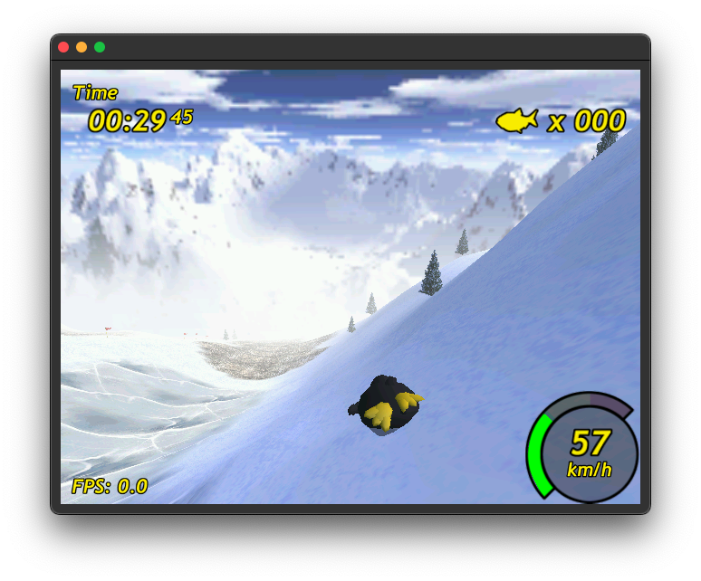
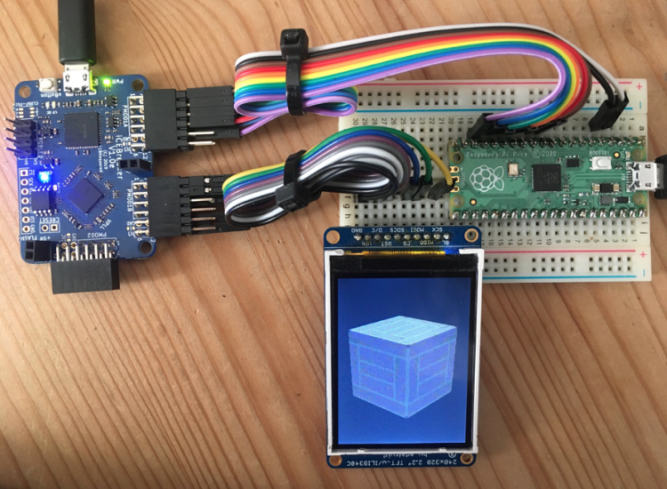
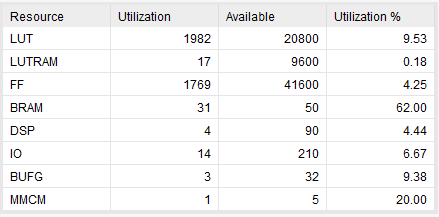

- [Rasterix](#rasterix)
- [Working games](#working-games)
- [How to build for the iCE40UP5K](#how-to-build-for-the-ice40up5k)
  - [iCE40UP5K build details](#ice40up5k-build-details)
    - [Utilization](#utilization)
    - [Pin out](#pin-out)
- [How to build for the Xilinx Artix-7 35 (Arty)](#how-to-build-for-the-xilinx-artix-7-35-arty)
  - [Utilization](#utilization-1)
- [How to build the simulation](#how-to-build-the-simulation)
- [Add the driver to your IDE](#add-the-driver-to-your-ide)
- [Design](#design)
  - [Driver](#driver)
  - [FPGA](#fpga)
- [Port to a new platform](#port-to-a-new-platform)
  - [Port the driver](#port-the-driver)
  - [Port the Rasterix](#port-the-rasterix)
- [Missing features](#missing-features)
- [Technical limitations](#technical-limitations)
  - [Near/far plane and depth buffer](#nearfar-plane-and-depth-buffer)
  - [Repetitions and Clamping](#repetitions-and-clamping)
    - [Bug](#bug)
  - [No depth buffer for glOrtho()](#no-depth-buffer-for-glortho)
- [Possible performance improvements in the software part](#possible-performance-improvements-in-the-software-part)
# Rasterix
The Rasterix is a rasterizer implementation mainly for an iCE40 FPGA. It can be used with micro controllers and offers an API similar to OpenGL. The main goal is/was to implement the whole fixed function pipeline of OpenGL 1.5 / OpenGL ES1.1 and that it is faster than a software implementation. I am confident that at least the second goal is achieved, but for the first one, a bigger FPGA is required. Currently some features like stencil buffer, fog, second texture unit, texture filtering and so on are missing.
Currently it has more the nature of a prototype and maybe a prove of concept. Hopefully this software is somehow useful for someone or is at least good enough for education or inspiration.

# Working games
I tried tuxracer in an simulation. It works and produces an playable image. Because of missing smooth shading, the texture transitions have a hard cut (see the cut between ice and snow). Fog planes and lighting also suffers from this fact. Missing texture filtering causes an pixelated look.


# How to build for the iCE40UP5K
First you have to install the following tools:
- cliffords icestrom
- Yosys 0.9 (git sha1 UNKNOWN, clang 11.0.3 -fPIC -Os)
- nextpnr-ice40 -- Next Generation Place and Route (Version 4512a9de)

Now execute the following steps
```
git clone https://github.com/ToNi3141/Rasterix.git
cd Rasterix/rtl/top/iCE40up5k
make 
make flash
```

This will by default build a bin file which expects a display with the resolution of 240x320.
To use other resolutions you can set the following variables:
```
X_RESOLUTION
Y_RESOLUTION
Y_LINE_RESOLUTION
```

```X_RESOLUTION``` and ```Y_RESOLUTION``` are defining the resolution of the whole screen. The iCE40 uses internally a 32kB memory for the color and an 32kB memory for the depth buffer. Because of that, only small screen resolutions can fit in the buffers. To support higher resolutions, ```Y_LINE_RESOLUTION``` can be used to divide the frame in several smaller frame lines. For instance, a screen resolution of 240x320x2 is requiring a roughly 5 times bigger frame buffer, than the iCE40 can handle. If we now divide the ```Y_RESOLUTION``` by 5 and use this resolution for the ```Y_LINE_RESOLUTION```, we get away with smaller local buffers and are still able to render an high resolution image. An example configuration could look like this:
```
make X_RESOLUTION=240 Y_RESOLUTION=320 Y_LINE_RESOLUTION=64
```

Please not that a ```glClear()``` will behave now differently when it is omitted. Normally, when you omit this, you would see the last frame. The Rasterix will show you an echo of the previous line.
## iCE40UP5K build details
Other iCE40 FPGAs are not working because they lack internal memory.
- 32kB Texture buffer, supported resolutions: 128x128, 64x64, 32x32.
- Perspective correct textures
- Transparency effects 
- Runs at 24MHz, maximum fill rate: 12MPixel (limited by the SPRAM, we can only read and write every other pixel. With dual port ram, we could increase the fill rate to one pixel per clock. The fill rate does not depend on the different render modes. Transparency, depth buffering and so on are not reducing the fill rate. The fill rate suffers from much small triangles (because of a few clock cycles setup time for each triangle) and by switching textures (each texture has to be completely uploaded to the hardware before it can continue with rendering).
- Displays can be directly connected to the iCE40. The top module implements a hardware, which serializes the color buffer and sends it via SPI to the display.
- Command SPI speed: up to 48MHz
- Display SPI speed: up to 24MHz
- 16 bit color (RGBA4444) 
- 16 bit depth buffer (w buffer)
### Utilization
```
Info: Device utilisation:
Info:            ICESTORM_LC:  4901/ 5280    92%
Info:           ICESTORM_RAM:    24/   30    80%
Info:                  SB_IO:    13/   96    13%
Info:                  SB_GB:     8/    8   100%
Info:           ICESTORM_PLL:     0/    1     0%
Info:            SB_WARMBOOT:     0/    1     0%
Info:           ICESTORM_DSP:     3/    8    37%
Info:         ICESTORM_HFOSC:     1/    1   100%
Info:         ICESTORM_LFOSC:     0/    1     0%
Info:                 SB_I2C:     0/    2     0%
Info:                 SB_SPI:     0/    2     0%
Info:                 IO_I3C:     0/    2     0%
Info:            SB_LEDDA_IP:     0/    1     0%
Info:            SB_RGBA_DRV:     0/    1     0%
Info:         ICESTORM_SPRAM:     4/    4   100%
...
Info: Max frequency for clock                          'clk': 25.04 MHz (PASS at 24.00 MHz)
Info: Max frequency for clock 'serial_sck$SB_IO_IN_$glb_clk': 102.01 MHz (PASS at 12.00 MHz)
```
### Pin out 
__PMOD A command signals__
| Signal  | PMOD  | IceBreaker  | Raspberry Pi Pico | Arduino |
|---------|-------|-------------|-------------------|---------|
| resetn  | 9     | 46          | 12                | 6       |
| mosi    | 2     | 2           | 3                 | 11      |
| sck     | 1     | 4           | 2                 | 10      |
| cs      | 8     | 48          | 11                | 5       |
| cts     | 10    | 44          | 13                | 7       |
| tft mux | 7     | 3           | 10                | 4       |
| tft cs  | 4     | 45          | 9                 | 9       |
| tft dc  | 3     | 47          | 8                 | 8       |

If the ```tft mux``` is asserted, it will multiplex the ```mosi```, ```sck```, ```tft cs``` and ```tft dc``` signals through the PMOD B signals. The MCU can directly communicate with the display, configure it, initialize it and so on.

__PMOD B display signals__
| Signal  | PMOD  | IceBreaker  |
|---------|-------|-------------|
| sck     | 1     | 43          |
| mosi    | 2     | 38          |
| reset   | 8     | 36          |
| dc      | 9     | 32          |
| cs      | 7     | 42          |

__Output of the example.ino__

# How to build for the Xilinx Artix-7 35 (Arty)
```
cd rtl/top/Xilinx
/Xilinx/Vivado/2020.1/bin/vivado -mode batch -source build.tcl
```
Note: Because you will probably use another vivado version. The build script uses a clock wizard which creates from the 100MHz oscillator on the Arty board a 90MHz clock. The design could probably also run with 100MHz and produce 100MPixel but that timing is really tight. As a quick and dirty solution, you can remove the ```clk_wiz_0``` from the ```build.tcl``` and ```top.v``` and use the 100MHz clock directly. It could work.

By default it runs with __90MHz__ and renders with __90MPixel__. By side that, it uses the same configuration like the ice40 build and the same pin out (PMOD JA for the command signals and PMOD JB for the display).

## Utilization


# How to build the simulation
The simulation uses Verilator 4.036 2020-06-06 rev v4.034-208-g04c0fc8aa to generate C++ code.
```
cd rtl/top/Verilator
make
```
After that, you can go to ```unittest/qtRasterizer``` and open the Qt project. This is a small simulation which renders an image (similar to the Arduino example) onto your screen.

It is likely, that your verialtor installation has another path as it is configured in the ```qtRasterizer.pro``` file. Let the variable  ```VERILATOR_PATH``` point to your verilator installation and rebuild the project.
# Add the driver to your IDE
You can find under arduino/rasterizer an example how to use the driver. Before you can use the driver, you have to copy all files in the lib/gl directory into the arduino library directory (if you are using the Arduino IDE). If you use another IDE add this files to your build system.
```
mkdir /<pathToArduinoLibDir>/Arduino/libraries/IceGL
cp -R /<pathToLib>/Rasterix/lib/gl/* /<pathToArduinoLibDir>/Arduino/libraries/IceGL
```
or you can create a symbolic link
```
ln -s /<pathToLib>/Rasterix/lib/gl/ /<pathToArduinoLibDir>/Arduino/libraries/IceGL
```
# Design
The following diagram shows roughly the flow a triangle takes, until it is seen on the screen.

For the s_cmd_axis command specification, please refer ```rtl/Rasterix/RegisterAndDescriptorDefines.vh```
## Driver
The driver is build with the following components:
- ```IceGLWrapper```: Wraps the IceGL API to a C API.
- ```IceGL```: The library which implements an OpenGL like API. The API is not complete, but everything which is programmed for IceGL should be compatible to OpenGL. If not, then it is a bug.
- ```TnL```: Implements the geometry transformation, clipping and lighting.
- ```Rasterizer```: This basically is the rasterizer. It implements the edge equation to calculate barycentric coordinates and also calculates increments which are later used in the hardware to rasterize the triangle. This is also done for texture coordinates and w.
- ```IRenderer```: Defines an interface from ```IceGL``` to an renderer. You can use this interface to implement a software renderer or a better version of the Renderer. 
- ```Renderer```: Implements the IRenderer interface, executes the rasterization, compiles display lists and sends them via the ```IBusConnecter``` to the Rasterix.
- ```DisplayList```: Contains all render commands produced from the Renderer and buffers them, before they are streamed to the Rasterix.
- ```IBusConnector```: This is an interface from the driver to to the Rasterix. Implement here your SPI driver. Alternatively, if you implement the Rasterix in you own FPGA system, implement here how to stream data from and to the RasteriCErs AXIS ports.
## FPGA
Note hat the blue boxes are specific for the iCE40 build. If you want to integrate it in your own system, only the parts in the Rasterix are relevant for you.
- ```SPI_Slave``` (3rd party): Implements a SPI slave to deserialize the data from the SPI bus.
- ```Serial2AXIS```: Converts the deserialized data from the SPI_Slave into an AXIS data stream.
- ```Rasterix```: Basically implements the Rasterix. It has an CMD_AXIS port where it receives the commands to render triangles, set render modes, upload textures and so on. It also has an FRAMEBUFFER_AXIS port where it streams out the data from the color buffer. Alternatively both AXIS ports can also be connected to other devices like DMAs, if you want to integrate the Rasterix in your own project.
- ```CommandParser```: Reads the data from the CMD_AXIS port, decodes the commands and controls the Rasterix.
- ```Rasterizer```: Takes the triangle parameters from the Rasterizer class (see the section in the Software) and rasterizes the triangle by using the precalculated values/increments.
- ```FragmentPipeline```: Consumes the fragments from the Rasterizer, does perspective correction, depth test, blend and texenv calculations, texture clamping and so on.
- ```TextureBuffer```: Buffers the texture.
- ```ColorBuffer```: Contains the color buffer.
- ```FrameBuffer```: Contains the depth buffer.
- ```DisplayControllerSPI```: Contains an internal buffer with the size of the FrameBuffer and serializes the data for an SPI display.
# Port to a new platform 
## Port the driver
To port the driver to a new MCU only a few steps are required.
1. Create a new class which derived from the ```IBusConnector```. Implement implement the virtual methods. This is also performance critical. Use (if possible) non blocking methods. Otherwise the rendering is slowed down because the data transfer blocks further processing.
2. Use this class for the Renderer.
3. Add the whole ```lib/gl``` directory to your build system.
4. Build

Now you are done with your port.

Note: A FPU can improve the performance drastically (around 5 times more triangles are possible). 
## Port the Rasterix
1. Connect the command AXIS channel (```s_cmd_axis```) to an device, which streams the data from the ```IBusConnector```. 
2. Connect the AXIS channel from the color buffer (```m_framebuffer_axis```) to an device, which can handle the color buffer.
3. Connect ```nreset``` to your reset line and ```aclk``` to your clock domain.
4. Add everything in ```rtl/Rasterix``` to your build system.
5. Synthesize.
# Missing features
The following features are currently missing compared to a real OpenGL implementation
- Texture filtering
- Smooth shading
- Stencil buffer
- Fog
- Rasterization of lines an points

# Technical limitations
## Near/far plane and depth buffer
The rasterizer uses for the depth buffer only the w component. It does not remap w to z. That means, ```glDepthRange()``` has no effect. 
The zNear plane must be bigger than 0.5. Lower values will overflow.
The zFar plane must be smaller than 128.0. Higher values will overflow.
The reason: The interpolated w component is the reciprocal of the vertex depth and for this we use a S1.30 number. The maximum value of this number will be a 1.999... If zNear is equal or smaller than 0.5, then the reciprocal will easily exceed the number range (it will be 2.0 or bigger). 

During perspective correction on the FPGA, the S1.30 (reciprocal of the vertex depth) number will be converted into a U1.15 number. This U1.15 number is the divisor of a Un.24 number (calculating now the reciprocal of the interpolated reciprocal vertex depth), the result will be a U7.9 number (because the multipliers in the iCE40 can only handle 16 bit multiplications). The maximum value of this number is 127.9999... Therefore the zFar plane should never exceed 128.0 because then it will overflow the corrected w.

By side that, the texture interpolation can also be affected by precision. For perspective correct textures, the texture coordinates have to be divided by w. If we have now an object, which is far away, the texture coordinates from this object will be divided by a big w. That means, lower significant bits are getting more important. The texture itself is interpolated as a S1.30 value, but during perspective correction, it is converted to a S1.14 number (the iCE40 only has 16 bit hardware multipliers) and here we lose a lot of precision. This value is then multiplied with w again and produces an unprecise value.

## Repetitions and Clamping
The rasterizer currently uses S1.30 numbers for the vertex attributes. This has a big influence on ```GL_REPEAT``` and ```GL_CLAMP_TO_EDGE``` because texture coordinates bigger than 2.0 will overflow. Over/Underflowing is not a real issue when we use ```GL_REPEAT``` on the hardware, because ```GL_REPEAT``` is defined to just cut off the integer part and only use the fractional part. It looks different when we use ```GL_CLAMP_TO_EDGE```. To clamp, we have to know, from where we are coming and if we are in our valid range (0.0 - 1.0). If an overflow occurs, we have no glue if we are coming from e.g. 10.0 or 2.0, so we have no glue when to draw the border. Or in other words: For clamping, we require the integer part, which right now has only one bit. 

It is not really possible to reduce the fractional part of the number and add more integer bits. We would loose precision on the texture interpolation, especially when we have a big object which is far away. This would result in a drifting texture. We could fix this by adding a wider register with a wider multiplication, but at least with the iCE40, this is not possible. This problem is similar to the one with the zNear and zFar planes.
### Bug
Currently there is a bug when we use lots of repetitions on big objects (object which is in object space bigger than 1.0 peer axis). Currently i don't know what happens there, but the textures are starting to move. I have still to investigate that.
What confuses a bit, the behavior is different when using the fixPoint rasterization or the floating point one. That suggests, that it has something to do with the parameter calculation and not with the hardware.
Use the following code to reproduce:
```    
    float planeS[4] = {8.5, 0, 0, 0};
    float planeT[4] = {0, 8.5, 0, 0};

    glTexGeni(GL_S, GL_TEXTURE_GEN_MODE, GL_OBJECT_LINEAR);
    glTexGeni(GL_T, GL_TEXTURE_GEN_MODE, GL_OBJECT_LINEAR);

    glTexGenfv(GL_S, GL_OBJECT_PLANE, planeS);
    glTexGenfv(GL_T, GL_OBJECT_PLANE, planeT);

    glEnable(GL_TEXTURE_GEN_S);
    glEnable(GL_TEXTURE_GEN_T);
```
Probably this is a precision problem.
## No depth buffer for glOrtho()
The hardware right now only supports a w buffer. When we have a matrix, which does not use the w component of a vector for the depth, then the depth buffer will not work. This can be observed with ```glOrtho()```. This matrix sets the w component of the vector to 1, doesn't matter which z value the vertex has, w stays 1.

# Possible performance improvements in the software part
- TnL Vertex Transformations: Normally, when we use vertex arrays, we could take the arrays, transform all vertices and normals and then start calculating light and so on. The reason why this is not done is memory. Currently i have embedded systems in mind and i don't want to allocate too much memory. The tradeoff is now that, we have to calculate the transformation several times, but we can save memory.
- Renderer DisplayList handling: Currently, we have one display list which represents the whole screen. But as earlier written, we have so called display lines. Typically a image is composed of several of this lines (similar to a tiled renderer). Right now, every time there is some space in the FiFo, we are iterating through the screen display list, searching for geometry for the current display line and compiling a new display list. This is slow and it is getting slower when the scene uses a lot of geometry. Also textures will be blindly loaded, even if there is no object which uses the texture in the current line. To improve that, we could discard the one display list for one screen approach and implement a display list for each line. This lists will be simultaneously filled when there is geometry which affects the line. Then we don't have to iterate several times though a big display list. This saves CPU time but increases the memory consumption (and again, we don't want this). To improve that even more, when we use a hardware flow control and a scatter/gather DMA, we can completely offload the display list upload from the CPU.
- Matrix handling: The handling of the matrices is not as good as it could be. Currently, if one matrix has changed, we recalculate all other matrices including the inverse of the model view matrix (which is used for the normal interpolation). This takes a lot of time and could sometimes omitted.
- Float vs fix point: Currently the library uses extensively floating point arithmetic. On a MCU with FPU, this is not a problem, but on MCUs without FPU, this slows down the calculations several times.