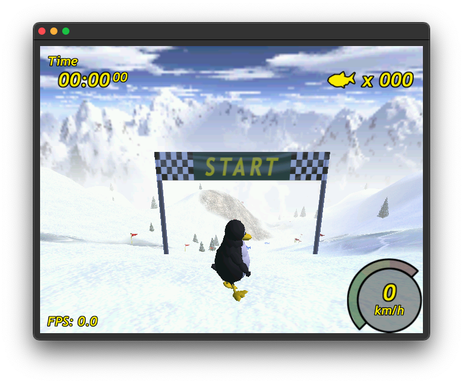

- [About this Project](#about-this-project)
  - [Area Usage](#area-usage)
- [Working Games](#working-games)
- [Checkout Repository](#checkout-repository)
- [Platforms](#platforms)
- [How to integrate](#how-to-integrate)
  - [How to port the Driver](#how-to-port-the-driver)
  - [How to use the Core](#how-to-use-the-core)
- [Missing Features](#missing-features)

# About this Project
The Rasterix project is a rasterizer implementation for FPGAs written in Verilog. It implements a mostly OpenGL 1.3 compatible fixed function pixel pipeline with a maximum of two TMUs and register combiners in hardware. The vertex pipeline is implemented in software.
The renderer is able to produce __100MPixel__ and __200MTexel__ at a clockspeed of 100MHz.

The project started as an experiment, how an 3D renderer can be implemented on an FPGA and slowly evolved to something, which is capable to render complex 3D scenes. The long term goal of this project is to recreate an open source fixed function renderer compatible with OpenGL ES 1.1 and OpenGL 1.5 suitable for embedded devices like microcontrollers. 

It comes in two variants, `RasterixIF` and `RasterixEF`. `IF` stands for internal framebuffer while `EF` stands for external framebuffer. Both variants have their advantages and drawbacks. But except of the framebuffer handling and resulting limitations, they are completely equal.

`RasterixIF`: This variant is usually faster, because it only loosely depends on the memory subsystem of your FPGA. The rendering is completely executed in the FPGAs static RAM resources. The drawback is the occupation of a lot of RAM resources on the FPGA and on your host.
For a reasonable performance, you need at least 128kB + 128kB + 32kB = 288kB memory only for the framebuffers. Less is possible but only useful for smaller displays. More memory is generally recommended.

The used memory is decoupled from the actual framebuffer size. If a framebuffer with a specific resolution won't fit into the internal framebuffer, then the framebuffer is rendered in several cycles where the internal framebuffer only contains a part of the whole framebuffer.

Because the framebuffer is split in several smaller ones, the host requires a display list for each partial framebuffer and must keep the display list, until the rendering is done. For a picture with a reasonable complexity, you can assume that the host requires several MB of memory just for the display lists. It also can screw up the rendering in some cases. When a new frame without glClear is drawn, you will not see the echo of the last frame, instead you will see the echo of the last partial frame.

`RasterixEF`: The performance of this variant heavily depends on the performance of your memory subsystem, because all framebuffers are on your system memory (typically DRAM). While the latency is not really important for the performance, but the the number of memory request the system can handle is even more. This is especially in the Xilinx MIG a big bottleneck for this design (because of this, it is around ~3 times slower that the `RasterixIF`). Another limitation of the memory subsystem / AXI bus (the strobe of the AXI bus works only byte wise, not bit wise): Stencil and color masks are not working correctly and the color buffer does not support an alpha channel.

The advantages are: It doesn't use FPGA memory resources for the framebuffers. They are free for other designs, but it needs a bit more additional logic to handle the memory requests. Another advantage is the usage of smaller display list with intermediate display list uploads. That reduces the memory footprint for the display lists on the host system to a few kB. It isn't anymore required to keep the whole frame in the display list, the display list now acts only as a buffer. With this configuration, the renderer works more like a traditional one.

Both variants can work either in fixed point or floating point arithmetic. The fixed point arithmetic has almost the same image quality and compatibility compared to the float arithmetic. All tested games are working perfectly fine with both, while the fixed point configuration only requires a fraction of the logic of the floating point configuration. The floating point version can run faster on the host system because it avoids the conversion from float to fixed point.

## Area Usage
Typical configuration: 
  - 64 bit command bus / memory bus
  - 256px textures
  - 1 TMU
  - mip mapping
  - fix point interpolation with 25 bit multipliers
  - internal framebuffer (rrxif)

Then the core requires __around 10k LUTs__ on a Xilinx Series 7 device.

High performance configuration: 
  - 128 bit command / memory bus
  - 256px textures
  - 2 TMUs
  - mip mapping
  - float interpolation with 32 bit floats
  - external frame buffer (rrxef)

Then the core requires __around 36k LUTs__ on a Xilinx Series 7 device.

# Working Games
Tested games are tuxracer (please see https://github.com/ToNi3141/tuxracer.git and the Branch `RasterixPort`), Quake 3 Arena with SDL2 and glX (https://github.com/ToNi3141/Quake3e), Warcraft 3 with WGL and others.



# Checkout Repository
Use the following commands to checkout the repository:

```sh
git clone https://github.com/ToNi3141/Rasterix.git
cd Rasterix
git submodule init
git submodule update
```

# Platforms
The rasterizer is running on the following platforms:

- [Verilator Simulation](/rtl/top/Verilator/README.md)
- [Digilent Nexys Video](/rtl/top/Xilinx/NexysVideo/README.md)
- [Digilent CMod7](/rtl/top/Xilinx/CmodA7/README.md)
- [Digilent ArtyZ7-20](/rtl/top/Xilinx/ArtyZ7-20/README.md)

# How to integrate
To integrate it into your own project, first have a look at the already existing platforms. If you want to integrate it in a already existing SoC system, you may have a look at the ArtyZ7. If you want to use it as standalone, have a look at the Nexys Video or CMod7.

The __pico-sdk__ and __PlatformIO__ are supported. See [Digilent CMod7](/rtl/top/Xilinx/CmodA7/README.md).

## How to port the Driver
To port the driver to a new interface (like SPI, async FT245, AXIS, or others) use the following steps:
1. Create a new class which is derived from the `IBusConnector`. Implement the virtual methods.
2. Set the build variables mentioned below in the table.
3. Add the whole `lib/gl`, `lib/3rdParty` and `lib/driver` directory to your build system. Or add this repository to your CMake project and include the library by adding `gl`.
4. Build

See also the example [here](/example/util/native/Runner.hpp).

The build system requires the following parameters to be set:

Note: Bold options are required to be equal to the hardware counterparts.

| Property                               | Description |
|----------------------------------------|-------------|
| __RRX_CORE_TMU_COUNT__                 | Number of TMUs the hardware supports. Must be equal to the FPGA configuration. |
| RRX_CORE_MAX_TEXTURE_SIZE              | The maximum texture resolution the hardware supports. A valid values is 256 for 256x256px textures. Make sure that the texture fits in __TEXTURE_BUFFER_SIZE__ of the FPGA. A 256x256px texture requires: __TEXTURE_BUFFER_SIZE__ = log2(256x256x2). |
| __RRX_CORE_ENABLE_MIPMAPPING__         | Set this to `true` when mip mapping is available. Must be equal to the FPGA configuration |
| RRX_CORE_MAX_DISPLAY_WIDTH             | The maximum width if the screen. All integers are valid like 1024. To be most memory efficient, this should fit to your display resolution. |
| RRX_CORE_MAX_DISPLAY_HEIGHT            | The maximum height of the screen. All integers are valid like 600. To be most memory efficient, this should fit to your display resolution. |
| __RRX_CORE_FRAMEBUFFER_SIZE_IN_WORDS__ | The size of the framebuffer in bytes. For the `rrxef` variant, use a value which fits at least the whole screen like 1024 * 600 * 2. For the `rrxif` variant, use the configuration size of the frame buffer. A valid value could be 65536 words. A word is the size of a pixel. Must be equal to the FPGA configuration. |
| __RRX_CORE_USE_FLOAT_INTERPOLATION__   | If `true`, it uploads triangle parameters in floating point format. If `false`, it uploads triangle parameters in fixed point format. Must be equal to the FPGA configuration. |
| RRX_CORE_NUMBER_OF_TEXTURE_PAGES       | The number of texture pages available. Combined with TEXTURE_PAGE_SIZE, it describes the size of the texture memory on the FPGA. This must never exceed the FPGAs available memory. |
| RRX_CORE_NUMBER_OF_TEXTURES            | Number of allowed textures. Lower value here can reduce the CPU utilization. Typically set this to the same value as NUMBER_OF_TEXTURE_PAGES. |
| __RRX_CORE_TEXTURE_PAGE_SIZE__         | The size of a texture page in bytes. Typical value is 4096. |
| RRX_CORE_GRAM_MEMORY_LOC               | Offset for the memory location. Typically this value is 0. Can be different when the memory is shared with other hardware, like in the Zynq platform. |
| RRX_CORE_FRAMEBUFFER_TYPE              | Configures the destination of the framebuffer. Must fit to the chosen __VARIANT__. `FramebufferType::INTERNAL_*` is used for the `rrxif`, `FramebufferType::EXTERNAL_*` is used for `rrxef` |
| RRX_CORE_COLOR_BUFFER_LOC_1            | Location of the first framebuffer when FramebufferType::EXTERNAL_* is used and the destination when FramebufferType::INTERNAL_TO_MEMORY is used. |
| RRX_CORE_COLOR_BUFFER_LOC_2            | Second framebuffer when `FramebufferType::EXTERNAL_MEMORY_DOUBLE_BUFFER` is used. |
| RRX_CORE_DEPTH_BUFFER_LOC              | Depth buffer location when `FramebufferType::EXTERNAL_*` is used. |
| RRX_CORE_STENCIL_BUFFER_LOC            | Stencil buffer location when `FramebufferType::EXTERNAL_*` is used. |


## How to use the Core
1. Add the files in the following directories to your project: `rtl/Rasterix/*`, `rtl/3rdParty/verilog-axi/*`, `rtl/3rdParty/verilog-axis/*`, `rtl/3rdParty/*.v`, and `rtl/Float/rtl/float/*`.
2. Instantiate the `RRX` module.  
3. Connect the `s_cmd_axis` interface to your command stream (this is the output from the `IBusConnector`).
4. Connect the `m_mem_axi` interface to a memory.
5. Optionally connect `m_framebuffer_axis` to an device, which can handle the color buffer stream (a display for instance). When using a memory mapped framebuffer, then this port is unused.
6. Connect the framebuffer signals (`swap_fb`, `fb_swapped`, `fb_addr`). They are used to signal an display controller, that it should swap the color buffer. `swap_fb` gets high when a swapping is requested, `fb_swapped` is used to signal that the swap request was acknowledged. `fb_addr` contains the address of the new color buffer. If this signals are not used, then connect them the following way: `assign fb_swapped = !swap_fb`. `fb_addr` can be left unconnected.
7. Connect `resetn` to your reset line and `aclk` to your clock domain.
8. Synthesize.

The hardware has the following configuration options:

Note: Bold options are required to be equal to the software counterparts.

| Property                                  | Variant | Description |
|-------------------------------------------|---------|-------------|
| __VARIANT__                               | if/ef   | The selected variant. Valid values are `if` for the rrxif and `ef` for the rrxef. |
| __FRAMEBUFFER_SIZE_IN_WORDS__             | if      | The size of the internal framebuffer (in power of two). <br> Depth buffer word size: 16 bit. <br> Color buffer word size: FRAMEBUFFER_SUB_PIXEL_WIDTH * (FRAMEBUFFER_ENABLE_ALPHA_CHANNEL ? 4 : 3). |
| FRAMEBUFFER_SUB_PIXEL_WIDTH               | if      | Sub pixel width in the internal framebuffer. |
| FRAMEBUFFER_ENABLE_ALPHA_CHANNEL          | if      | Enables the alpha channel in the framebuffer. |
| __ENABLE_STENCIL_BUFFER__                 | if/ef   | Enables the stencil buffer. |
| __TMU_COUNT__                             | if/ef   | Number of TMU the hardware shall contain. Valid values are 1 and 2. |
| __TEXTURE_PAGE_SIZE__                     | if/ef   | The page size of the texture memory. |
| __ENABLE_MIPMAPPING__                     | if/ef   | Enables the mip mapping. |
| __TEXTURE_BUFFER_SIZE__                   | if/ef   | Size of the texture buffer in log2(bytes). |
| ADDR_WIDTH                                | if/ef   | Width of the AXI address channel. |
| ID_WIDTH                                  | if/ef   | Width of the AXI id property. Should be at least 4. |
| DATA_WIDTH                                | if/ef   | Width of the AXI data property. |
| STRB_WIDTH                                | if/ef   | Width of the AXI strobe property. Should always be 8 bit per byte. |
| __RASTERIZER_ENABLE_FLOAT_INTERPOLATION__ | if/ef   | `true` enables the floating point interpolation. `false` enables the fixed point interpolation. |
| RASTERIZER_FIXPOINT_PRECISION             | if/ef   | Defines the width of the multipliers used in the fixed point interpolation. Valid range: 16-25. |
| RASTERIZER_FLOAT_PRECISION                | if/ef   | Precision of the floating point arithmetic. Valid range: 20-32. |


# Missing Features
The following features are currently missing compared to a real OpenGL implementation
- Logic Ops
- ...
