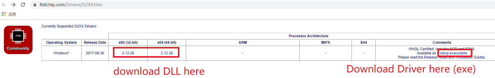
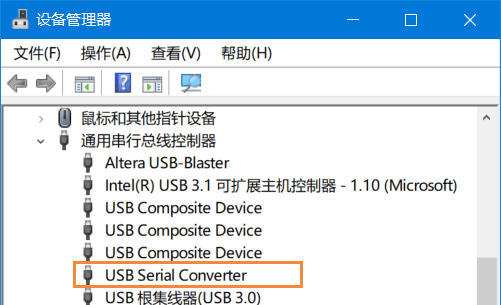

安装 FTD2XX 驱动和 Python FTD2XX 库
====================================

要在 Windows 上运行 FT232H 相关的 Python 程序，请进行以下步骤： 

> 注：该文档写于 2019 年，如果之后官网更新，大致流程肯定不变，但一些操作细节（例如官网上找不到下载文件了）就要变通变通了。

### 步骤1：安装 FTD2XX 驱动和 FTD2XX.DLL

进入 [D2XX Driver 官网页面](https://www.ftdichip.com/Drivers/D2XX.htm) ，在 D2XX Drivers 那一栏的表格里，下载exe形式的驱动并安装。如下图。

另外，要下载 DLL 压缩包， 解压后在里面找到符合你计算机的 FTD2XX.DLL 文件。若为32位计算机，请找到 32-bit(i386) DLL；若为64位计算机，请找到64-bit(amd64) DLL。如果文件名是 FTD2XX64.DLL 等，请一律重命名为 FTD2XX.DLL



### 步骤2：验证驱动安装

将开发板的 FT232H USB 口插入电脑，如果驱动安装成功，则 Windows 设备管理器里应该识别出 **USB Serial Converter** 。如下图。



### 步骤3：安装 Python3

如果你没有安装 Python3， 请前往 [Anaconda官网](https://www.anaconda.com/products/individual) 下载安装 Python3 ，大版本号必须是 Python3 ，小版本号不限，Python3.6，Python3.9 之类的均可。

注：若为32位计算机，请安装32位的Python；若为64位计算机，请安装64位的Python。

### 步骤4：安装 python ftd2xx 库

打开 CMD 或 PowerShell ，运行命令：

```powershell
pip install ftd2xx
```

### 步骤5：复制 FTD2XX.DLL 文件到 Python 环境中

复制步骤1中我们找到的 FTD2XX.DLL 文件到 Python 根目录（例如在我的电脑上， Python 根目录是 **C:/Anaconda3/** ）。注意32位的Python必须对应32位的DLL；64位的Python必须对应64位的DLL。

然后，可以在 python 中运行以下语句来验证安装：

```python
import ftd2xx
```


至此，FT232H 所需的 Python 运行环境已就绪。
