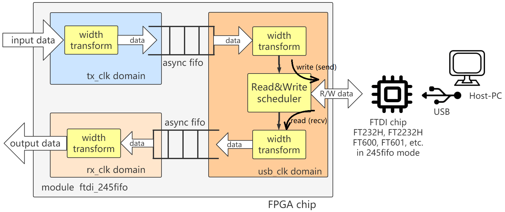
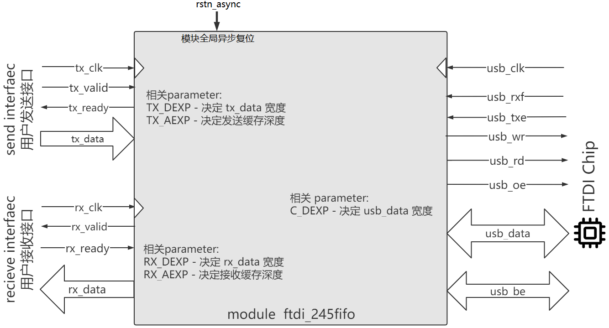
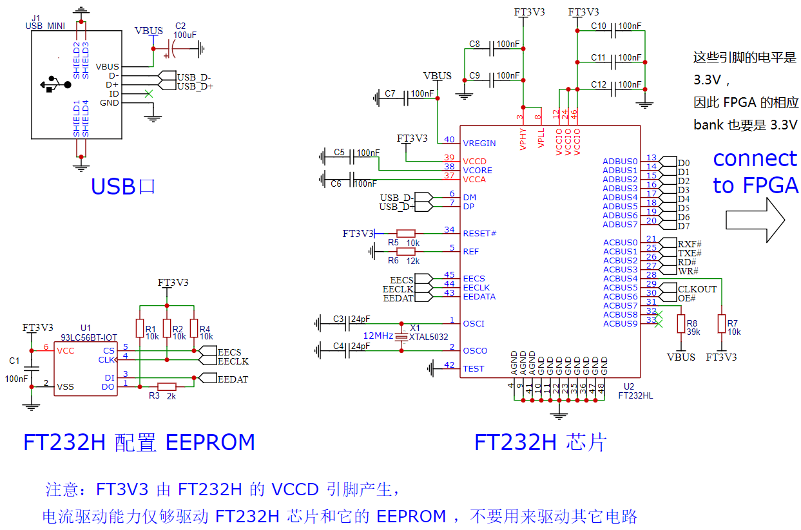
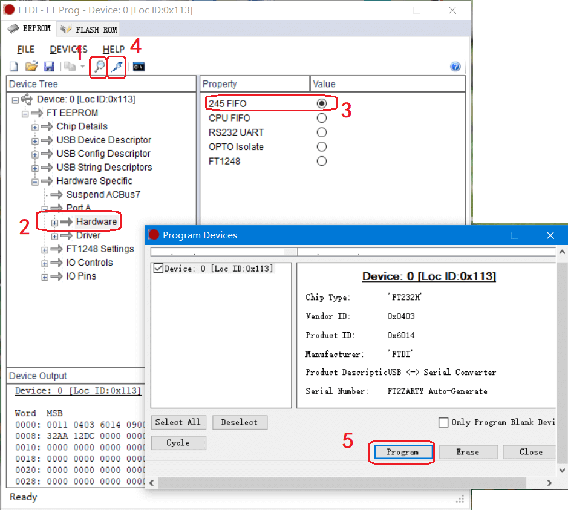
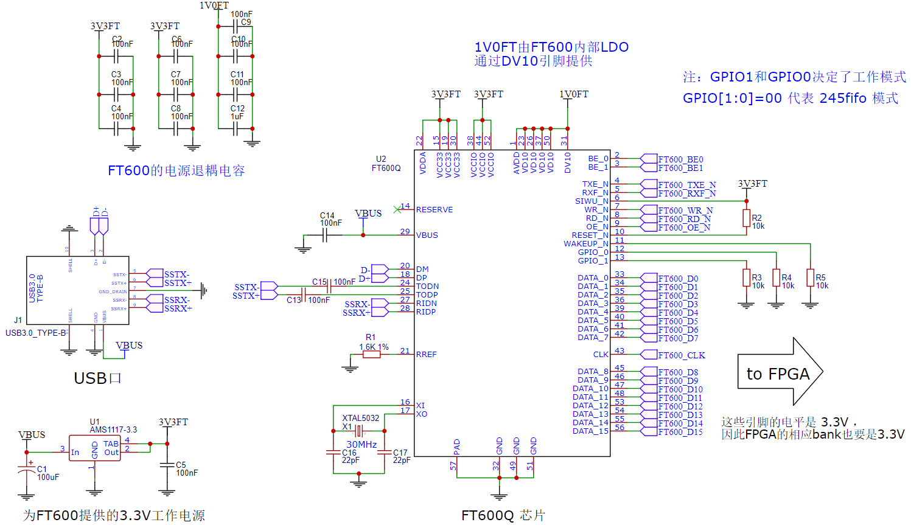

-CAD09D.svg)   

FTDI 245fifo controller
===========================
[FT232H](https://ftdichip.com/Products/ICs/FT232H.htm)、[FT2232H](https://ftdichip.com/Products/ICs/FT2232H.htm)、[FT600](https://ftdichip.com/Products/ICs/FT600.html) 、 [FT601](https://ftdichip.com/Products/ICs/FT600.html) 等芯片的 sync-245-fifo 模式的控制器，实现 FPGA 与 Host-PC 的高速通信。

# 简介

**sync-245-fifo 模式** （简称 **245fifo 模式**）是 FTDI 公司的 USB 系列芯片的最高速传输模式。本库将 245fifo 控制器封装成 Verilog 模块，留出精简的流式收发接口 ，供 Verilog 开发者调用。

另外，本库提供配套的 FPGA 示例工程、驱动安装教程、Python 软件库安装教程，并提供几个 Python 程序用于测试。

**图1**是该模块的结构框图。

|  |
| :------------------------------------------: |
|   **图1**：ftdi_245fifo.sv 模块的结构框图    |

## 特点

* **收发调度**：FTDI USB 芯片与 FPGA 之间的接口是半双工的，该模块调度收发分时复用，实现 **收发接口互相独立** 。
* **跨时钟域**：FTDI USB 芯片有自己的时钟。该模块用异步 FIFO 实现时钟域转换，使得收发接口可使用 **自定义时钟** 。
* **位宽变换**：FTDI USB 芯片数据位宽是固定的，但本模块实现了位宽变换。收发接口的 **位宽可自定义** 。

## 性能测试结果

以下是用本库测出来的 USB 上行（FPGA发，Host-PC收）的通信速率。

| 芯片型号    | FT232H 或 FT2232H |  FT600     | FT601      |
| :--------: | :------------:     |   :------:    | :--------: |
| **USB模式** | USB2.0 HS          |  USB3.0 SS     | USB3.0 SS  |
| **理论速率** | 60MBps             |  200MBps      | 400MBps  |
| **实测速率** | 42MBps           |  120MBps       | 未测 |

# 模块说明

本库的设计代码是 RTL 目录中的 ftdi_245fifo.sv，供 FPGA 开发者调用来开发自己的 USB 通信业务，它的接口和参数如**图2**。

|  |
| :----------------------------------: |
|   **图2**：ftdi_245fifo.sv 的接口    |

## 模块参数

要调用本模块，首先要根据实际情况确定各个参数 (Verilog parameter) 的值，如下表：

| parameter | 说明                                                         |
| --------- | ------------------------------------------------------------ |
| TX_DEXP   | 决定了用户发送接口的数据宽度（即tx_data的宽度）：0对应8bit宽，1对应16bit宽，2对应32bit宽，3对应64bit宽，以此类推。可以根据实际需要任意设置，不受所选的 USB 芯片型号限制。 |
| TX_AEXP   | 决定了用户发送缓存的深度，深度=2^TX_AEXP。默认为10（即默认深度为1024），如果 FPGA BRAM 较大，该项可以设得更大，来提高突发性能。 |
| RX_DEXP   | 决定了用户接收接口的数据宽度（即rx_data的宽度）：0对应8bit宽，1对应16bit宽，2对应32bit宽，3对应64bit宽，以此类推。可以根据实际需要任意设置，不受所选的 USB 芯片型号限制。 |
| RX_AEXP   | 决定了用户接收缓存的深度，深度=2^RX_AEXP。默认为10（即默认深度为1024），如果 FPGA BRAM 较大，该项可以设得更大，来提高突发性能。 |
| C_DEXP    | 决定了USB数据信号（即usb_data）的宽度：0对应8bit宽，1对应16bit宽，2对应32bit宽，3对应64bit宽。应该根据所选的 USB 芯片型号而设置：FT232H设为0，FT600设为1，FT601设为2。 |

## 模块接口：复位

rstn_async 是模块的全局异步复位信号，0代表复位，1代表释放复位。在使用中，该信号可以直接设为 `1'b1` ；或者连接到工程的复位信号上。

## 模块接口：连接 FTDI USB 芯片的接口

usb_rxf, usb_txe, usb_oe, usb_rd, usb_wr, usb_data, usb_be 这些信号应约束到 FPGA 的引脚上，连接到对应的 FTDI USB 芯片的引脚上。注意以下几点：

* FTDI USB 芯片工作在 245fifo 模式时，引脚名称见芯片 Datasheet（以 FT232H 为例，见 [FT232H DataSheet](https://www.ftdichip.com/Support/Documents/DataSheets/ICs/DS_FT232H.pdf) 第9页）。
* usb_be 信号是字节独热码，仅 FT600 和 FT601 芯片有这个信号。对于 FT232H 和 FT2232H ，请忽略它。
* 这些引脚的时序由模块维护，不需要你关注。如果你感兴趣，可以运行[模块RTL仿真](#模块仿真) 。

## 模块接口：用户发送接口

本模块内置一个发送缓存，开发者需要提供一个 tx_clk 时钟，并在该时钟域下操作 tx_valid, tx_ready, tx_data 这三个信号，来把数据从 FPGA 发送到发送缓存，（Host-PC上启动接收程序时，发送缓存中的数据会自动发给PC）。注意以下几点：

* tx_clk 的频率不限，tx_valid, tx_ready, tx_data 信号应该在 tx_clk 的上升沿更新或捕获。
* tx_valid=1 时，说明用户想发送一个数据到模块内部的发送缓存。同时，tx_data 应产生有效数据。
* tx_ready=1 时，说明模块已经准备好接收发送数据。tx_ready=0 时，发送缓存暂时满，不能接收更多数据。
* tx_valid 与 tx_ready 是一对握手信号。二者同时为 1 时， tx_data 写入缓存成功。

以如下波形图举例，在这个波形图中，用户接口发送了3个数据：D1, D2, D3 。其中：

* 第 1, 2 周期，用户令 tx_valid=0 ，因此暂时空闲没发数据。

* 第 3 周期，用户要发 D1，因此令 tx_valid=1，本周期 tx_ready=1 ，说明 D1 即刻发送成功。

* 第 4, 5, 6, 7 周期，用户要发 D2，因此令 tx_valid=1，但第 4, 5, 6 周期 tx_ready=0 导致发送暂时失败，直到第 7 周期 tx_ready=1 时，才发送成功。

* 第 8, 9 周期，用户令 tx_valid=0 ，因此暂时空闲没发数据。

* 第 10 周期，用户要发 D3，因此令 tx_valid=1，本周期 tx_ready=1 ，说明 D3 即刻发送成功。

      cycle       1     2     3     4     5     6     7     8     9     10    11
                _    __    __    __    __    __    __    __    __    __    __    __
       clk       \__/  \__/  \__/  \__/  \__/  \__/  \__/  \__/  \__/  \__/  \__/  \
                            _____________________________             _____
      tx_valid  ___________/                             \___________/     \________
                _________________                   ________________________________
      tx_ready                   \_________________/
                            _____ _______________________             _____
      tx_data   XXXXXXXXXXXX__D1_X___________D2__________XXXXXXXXXXXXX__D3_XXXXXXXXX

## 模块接口：用户接收接口

本模块内置一个接收缓存，开发者需要提供一个 rx_clk 时钟，并在该时钟域下操作 rx_valid, rx_ready, rx_data 这三个信号，来把来自 Host-PC 的暂存在接收缓存内的数据拿出来。它与用户发送接口时序相同，但方向相反。注意以下几点：

* rx_clk 的频率不限（当然，可以和 tx_clk 接在同一个时钟上），rx_valid, rx_ready, rx_data 信号应该在 rx_clk 的上升沿更新或捕获。
* rx_valid=1 时，说明模块想发送一个数据给用户。同时，rx_data 上出现有效数据。而 rx_valid=0 时，接收缓存空，不能拿出更多数据。
* rx_ready=1 时，说明用户已经准备好拿出一个数据。
* rx_valid 与 rx_ready 是一对握手信号。二者同时为 1 时， rx_data 才成功从接收缓存中取出。

用户接收接口的时序类似用户发送接口（唯一的区别是方向相反），因此这里不再举例说明其波形图。

模块仿真
=============================

如果你好奇 ftdi_245fifo.sv 模块的设计细节，或者想了解 FTDI USB 芯片的 245fifo 模式的操作时序，可以运行仿真。

仿真相关的文件都在 SIM 文件夹中，其中：

- tb_ftdi_245fifo.sv 是针对 ftdi_245fifo.sv 的 testbench，它模拟了一个简单的 FT232H 的行为，并与 ftdi_245fifo.sv 互相交换数据。
- tb_ftdi_245fifo_run_iverilog.bat 是运行 iverilog 仿真的命令脚本。

使用 iverilog 进行仿真前，需要安装 iverilog ，见：[iverilog_usage](https://github.com/WangXuan95/WangXuan95/blob/main/iverilog_usage/iverilog_usage.md)

然后双击 tb_ftdi_245fifo_run_iverilog.bat 运行仿真，然后可以打开生成的 dump.vcd 文件查看波形。

# 开始使用 FT232H

FT232H 是 USB2.0 High Speed 通信芯片，理论速率为 60MBps ，本例实现 FPGA 通过 FT232H 与 Host-PC 进行通信。

> 注：本例也适用于 FT2232H （具体操作时需要你自己变通变通），因为 FT2232H 与 FT232H 高度相似， FT2232H 的 **channel A** 可配置成与 FT232H 完全相同的 **245fifo 接口** 。

## 步骤1：安装驱动和库

请按照 [FTD2XX_guide.md](./FTD2XX_guide.md) 的指示在 Host-PC （Windows系统） 上安装 FTD2XX 驱动和 Python FTD2XX 库。

## 步骤2：部署 FPGA 工程

请使用以下源文件建立 FPGA 工程：

* [FT232H_example/fpga_top.sv](./FT232H_example/fpga_top.sv) ：作为工程的顶层。
* [RTL](./RTL) 文件夹里 ftdi_245fifo.sv 、 stream_async_fifo.sv 、 stream_wtrans.sv ：它们会被 fpga_top.sv 调用。

然后，请在 FPGA 工程中进行引脚约束，具体而言，你需要查看电路板的原理图（或开发板配套资料），了解 FT232H 的各引脚被连接到了 FPGA 的哪些引脚号上；然后，把 FPGA 工程的顶层（也就是 fpga_top.sv）的信号分配到对应的 FPGA 引脚号上，使得这些信号与 FT232H 的引脚对应起来。对应关系见下表（该表简化自 [FT232H DataSheet](https://www.ftdichip.com/Support/Documents/DataSheets/ICs/DS_FT232H.pdf) 第9页）：

| FT232H引脚号 | FT232H引脚名 | FT232H引脚名 (245fifo 模式下) | 应约束到 fpga_top.sv 的信号名 |
| :----------: | :----------: | :---------------------------: | :---------------------------: |
|      13      |    ADBUS0    |              D0               |          usb_data[0]          |
|      14      |    ADBUS1    |              D1               |          usb_data[1]          |
|      15      |    ADBUS2    |              D2               |          usb_data[2]          |
|      16      |    ADBUS3    |              D3               |          usb_data[3]          |
|      17      |    ADBUS4    |              D4               |          usb_data[4]          |
|      18      |    ADBUS5    |              D5               |          usb_data[5]          |
|      19      |    ADBUS6    |              D6               |          usb_data[6]          |
|      20      |    ADBUS7    |              D7               |          usb_data[7]          |
|      21      |    ACBUS0    |             RXF\#             |            usb_rxf            |
|      25      |    ACBUS1    |             TXE\#             |            usb_txe            |
|      26      |    ACBUS2    |             RD\#              |            usb_rd             |
|      27      |    ACBUS3    |             WR\#              |            usb_wr             |
|      28      |    ACBUS4    |            SIWU\#             |       usb_siwu \*  (=1)       |
|      29      |    ACBUS5    |            CLKOUT             |            usb_clk            |
|      30      |    ACBUS6    |             OE\#              |            usb_oe             |
|      31      |    ACBUS7    |           PWRSAV\#            |      usb_pwrsav \*  (=1)      |
|      34      |   RESET\#    |            RESET\#            |      usb_resetn \*  (=1)      |

> **\*注**：上表中 SIWU\# 、 PWRSAV\# 和 RESET\# 实际上是永远被拉为高电平的（你也可以看到在 fpga_top.sv 中它们被 assign 为 1），因此有些板子的设计直接用电阻把它们拉到高电平上，而没有连接到 FPGA ，对于这种情况，就不用在 FPGA 约束它们的引脚，并直接在 fpga_top.sv 中注释掉与它们相关的语句即可。
>
> **注**：对于 FT2232H ，请以 [FT2232H DataSheet](https://www.ftdichip.com/Support/Documents/DataSheets/ICs/DS_FT2232H.pdf) 第9页为准。

如果你要自己画 FT232H 的 PCB，可参考**图3** 。

|  |
| :-----------------------------------------------------: |
|      **图3**：FT232H USB 接口电路的参考原理图设计       |

在 FPGA 工程中，另外注意以下几点：

* usb_clk 频率为 60MHz 。你可以把 usb_clk 约束为 60MHz，来指导时序分析。实际上，即使不加该约束也不影响正常运行。
* fpga_top.sv 中的主时钟 clk 要连在 FPGA 板的晶振上，频率不限，比如 24MHz, 50MHz, 100MHz 均可。
* led 引脚连一颗 LED 灯（不是必须的），它平常保持 1，当发现接收到的数据不是递增的时，会变成 0 并保持一秒。
* 请关注本例 fpga_top.sv 中 ftdi_245fifo 模块的参数配置：
  * C_DEXP 被设为 0，这是因为 FT232H 的数据线是 8bit 的。
  * TX_DEXP 被设为 3，因此用户发送接口的 tx_data 信号的宽度是 64bit （这只是本例的取值，你可以根据你的项目需要来修改）。
  * RX_DEXP 参数被设为 0，因此用户接收接口的 rx_data 信号的宽度是 8bit （这只是本例的取值，你可以根据你的项目需要来修改）。

然后你就可以编译工程，步骤略。

## 步骤3：烧录 FT232H 芯片

针对每颗 FT232H 芯片，需要在初次使用时烧录为 245fifo 模式。每颗 FT232H 芯片只需要烧录一次，因为 FT232H 外围会有个 EEPROM 芯片用来永久保存配置，之后每次使用都不需要再烧录（除非你又烧录了其它模式）。

首先进入 [FT_Prog下载页面](https://ftdichip.com/utilities/#ft_prog) 下载并安装  **FT_Prog** 软件。然后进行以下步骤：

* 在电脑上插入你需要烧录的 FT232H 的 USB 接口，并拔出所有其它 FTDI USB 芯片设备（包括拔出所有的 FPGA 下载器，因为很多 FPGA 下载器，例如 Xilinx Digilent 下载器是 FT2232H 芯片实现的，如果万一覆盖了下载器内部的程序，你的下载器就废了）。
* 打开 **FT_Prog** 软件。
* 如**图4**，点击 **Scan and Parse** （图标为小放大镜） ，扫描出插在该电脑的所有 FTDI 芯片，找到 FT232H 对应的芯片。
* 在 FT232H 下方的属性树中逐级展开，找到并点击 Hardware 。
* 在右侧选择 245 FIFO 模式。
* 点击上方工具栏中的 **Program** （图标为小闪电）。
* 弹出确认窗口，点击 Program。烧录到 FT232H 。
* 烧录后，需要重新拔插 FT232H 的 USB 接口，该配置才能生效。

|   |
| :----------------------------------------------: |
| **图4**：烧录 FT232H 芯片，配置为 245fifo 模式。 |

## 步骤4：在电脑上运行通信程序

我在 [FT232H_example/Python](./FT232H_example/Python) 文件夹中提供了以下几个 Python 程序，它们会通过 FT232H 与 FPGA 进行通信。运行这些程序之前，请确保 FT232H 已经按照步骤3被烧录为 245fifo 模式，且 FPGA 中下载了步骤2中建立的工程。

| 文件名                  | 功能                                                         |
| ----------------------- | ------------------------------------------------------------ |
| USB_FT232H.py           | 定义了 USB_FT232H_sync245mode 类，实现了 构造函数, close, send, recv 方法，它会被以下文件调用。 |
| usb_rx.py               | 简单地试图接收 32 个字节（FPGA 发送，Host-PC 接收）          |
| usb_tx.py               | 简单地发送 16 个字节（FPGA 接收，Host-PC 发送）              |
| usb_rx_rate.py          | Host-PC 不断接收大量数据，并统计通信速率                     |
| usb_rx_tx_validation.py | 同时进行收发正确性验证，它会不间断地发送和接收。因为配套的 FPGA 程序会发送的是递增数据，所以该程序会验证收到的数据是否连续递增（遇到不连续则警告并退出）。同时该程序也会不断地发递增的数据，FPGA也会验证收到的数据是否连续递增，遇到不连续则把 led 管脚置 0（灯灭）一秒。通常，程序开始运行时灯会灭一秒（因为本次和上次收到的数据肯定不连续），但之后正常情况下不会再灭。 |

# 开始使用 FT600

FT600 是 USB3.0 Super Speed 通信芯片，理论速率为 200MBps ，本例实现 FPGA 通过 FT600 与 Host-PC 进行通信。

## 步骤1：安装驱动和库

请按照 [FTD3XX_guide.md](./FTD3XX_guide.md) 的指示在 Host-PC （Windows系统） 上安装 FTD3XX 驱动和 Python FTD3XX 库。

## 步骤2：部署 FPGA 工程

请使用以下源文件建立 FPGA 工程：

* [FT600_example/fpga_top.sv](./FT600_example/fpga_top.sv) ：作为工程的顶层。
* [RTL](./RTL) 文件夹里 ftdi_245fifo.sv 、 stream_async_fifo.sv 、 stream_wtrans.sv ：它们会被 fpga_top.sv 调用。

然后，请在 FPGA 工程中进行引脚约束，具体而言，你需要查看电路板的原理图（或开发板配套资料），了解 FT600 的各引脚被连接到了 FPGA 的哪些引脚号上；然后，把 FPGA 工程的顶层（也就是 fpga_top.sv）的信号分配到对应的 FPGA 引脚号上，使得这些信号与 FT600 的引脚对应起来。对应关系见下表（该表简化自 [FT600 DataSheet](https://www.ftdichip.com/Support/Documents/DataSheets/ICs/DS_FT600Q-FT601Q%20IC%20Datasheet.pdf) 第 7\~10 页）：

| FT600引脚号 | FT600引脚名 | 应约束到 fpga_top.sv 的信号名 |
| :---------: | :---------: | :---------------------------: |
|     33      |   DATA_0    |          usb_data[0]          |
|     34      |   DATA_1    |          usb_data[1]          |
|     35      |   DATA_2    |          usb_data[2]          |
|     36      |   DATA_3    |          usb_data[3]          |
|     39      |   DATA_4    |          usb_data[4]          |
|     40      |   DATA_5    |          usb_data[5]          |
|     41      |   DATA_6    |          usb_data[6]          |
|     42      |   DATA_7    |          usb_data[7]          |
|     45      |   DATA_8    |          usb_data[8]          |
|     46      |   DATA_9    |          usb_data[9]          |
|     47      |   DATA_10   |         usb_data[10]          |
|     48      |   DATA_11   |         usb_data[11]          |
|     53      |   DATA_12   |         usb_data[12]          |
|     54      |   DATA_13   |         usb_data[13]          |
|     55      |   DATA_14   |         usb_data[14]          |
|     56      |   DATA_15   |         usb_data[15]          |
|      2      |    BE_0     |           usb_be[0]           |
|      3      |    BE_1     |           usb_be[1]           |
|     43      |   CLKOUT    |            usb_clk            |
|      5      |    RXF_N    |            usb_rxf            |
|      4      |    TXE_N    |            usb_txe            |
|      9      |    OE_N     |            usb_oe             |
|      8      |    RD_N     |            usb_rd             |
|      7      |    WR_N     |            usb_wr             |
|      6      |   SIWU_N    |       usb_siwu \*  (=1)       |
|     10      |   RESET_N   |      usb_resetn \*  (=1)      |
|     11      |  WAKEUP_N   |     usb_wakeupn \*\*  (=0)    |
|     12      |    GPIO0    |     usb_gpio0 \*\*  (=0)      |
|     13      |    GPIO1    |     usb_gpio1 \*\*  (=0)      |

> **\*注**：上表中 SIWU_N 和 RESET_N 实际上是永远被拉为高电平的（你也可以看到在 fpga_top.sv 中它们被 assign 为 1），因此有些板子的设计直接用电阻把它们拉到高电平上，而没有连接到 FPGA ，对于这种情况，就不用在 FPGA 约束它们的引脚，并直接在 fpga_top.sv 中注释掉与它们相关的语句即可。
>
> **\*\*注**：上表中 WAKEUP_N 、 GPIO0 和 GPIO1 实际上是永远被拉为低电平的（你也可以看到在 fpga_top.sv 中它们被 assign 为 0），因此有些板子的设计直接用电阻把它们拉到GND上，而没有连接到 FPGA ，对于这种情况，就不用在 FPGA 约束它们的引脚，并直接在 fpga_top.sv 中注释掉与它们相关的语句即可。

如果你要自己画 FT600 的 PCB，可参考**图5** 。

|  |
| :---------------------------------------------------: |
|      **图5**：FT600 USB 接口电路的参考原理图设计      |

在 FPGA 工程中，另外注意以下几点：

* usb_clk 频率为 100MHz 。你可以把 usb_clk 约束为 100MHz，来指导时序分析。实际上，即使不加该约束也不影响正常运行。
* fpga_top.sv 中的主时钟 clk 要连在 FPGA 板的晶振上，频率不限，比如 24MHz, 50MHz, 100MHz 均可。
* led 引脚连一颗 LED 灯（不是必须的），它平常保持 1，当发现接收到的数据不是递增的时，会变成 0 并保持一秒。
* 请关注本例 fpga_top.sv 中 ftdi_245fifo 模块的参数配置：
  * C_DEXP 被设为 1，这是因为 FT600 的数据线是 16bit 的。
  * TX_DEXP 被设为 3，因此用户发送接口的 tx_data 信号的宽度是 64bit（这只是本例的取值，你可以根据你的项目需要来修改）。
  * RX_DEXP 参数被设为 0，因此用户接收接口的 rx_data 信号的宽度是 8bit（这只是本例的取值，你可以根据你的项目需要来修改）。

然后你就可以编译工程，步骤略。

## 步骤3：在电脑上运行通信程序

我在 [FT600_example/Python](./FT600_example/Python) 文件夹中提供了以下几个 Python 程序，它们会通过 FT600 与 FPGA 进行通信。运行这些程序之前，请确保 FPGA 中下载了步骤2中建立的工程。

| 文件                    | 功能                                                         |
| ----------------------- | ------------------------------------------------------------ |
| USB_FT600.py            | 定义了 USB_FT600_sync245mode 类，实现了 构造函数, close, send, recv 方法，它会被其它文件调用。 |
| usb_rx.py               | 简单地试图接收 32 个字节（FPGA 发送，Host-PC 接收）          |
| usb_tx.py               | 简单地发送 16 个字节（FPGA 接收，Host-PC 发送）              |
| usb_rx_rate.py          | Host-PC 不断接收大量数据，并统计通信速率                     |
| usb_rx_tx_validation.py | 同时进行收发正确性验证，它会不间断地发送和接收。因为配套的 FPGA 程序会发送的是递增数据，所以该程序会验证收到的数据是否连续递增（遇到不连续则警告并退出）。同时该程序也会不断地发递增的数据，FPGA也会验证收到的数据是否连续递增，遇到不连续则把 led 管脚置 0（灯灭）一秒。通常，程序开始运行时灯会灭一秒（因为本次和上次收到的数据大概率不连续），但之后正常情况下不会再灭。 |

# 参考资料

* FT232H 芯片资料：http://www.ftdichip.cn/Products/ICs/FT232H.htm
* FT232H 软件示例：http://www.ftdichip.cn/Support/SoftwareExamples/CodeExamples.htm
* FT600 芯片资料：http://www.ftdichip.cn/Products/ICs/FT600.html
* FT600/FT601 软件示例： http://www.ftdichip.cn/Support/SoftwareExamples/FT60X.htm
