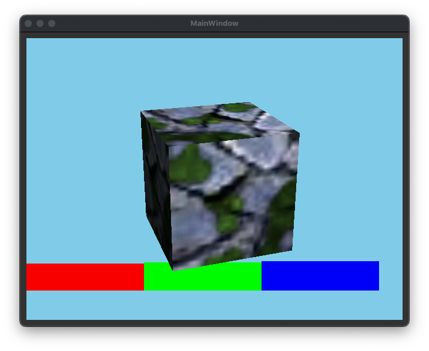

# Simulation Build
A simulation can be used to easily develop and debug the renderer. The simulation can be found under `example/qtDebug/qtRasterizerFpga`. There is a Qt project which can be opened with the QtCreator. This project supports also the real hardware, which can be selected with the `TARGET_BUILD` variable in the .pro file.

Before building the simulation, create the C++ code from the Verilog source via Verilator 4.036 2020-06-06 rev v4.034-208-g04c0fc8aa. Use the following commands:
```sh
cd rtl/top/Verilator
make -f Makefile.linux rrxif -j
```
Then build the Qt project. If the build was successful, you will see the following image on the screen, when you have started the application:



You see here a cube with enabled multi texturing and lighting. Below you can see RGB colors testing the scissor.

It is likely, that your verialtor installation has another path than it is configured in the `qtRasterizer.pro` file. Let the variable  `VERILATOR_PATH` point to your verilator installation and rebuild the project.

Note: Currently the build is only tested on OS X and linux. The .pro file must be adapted for other operating systems.

There exists a second project `example/qtDebug/qtRasterizerGL`. This project uses the native OpenGL implementation of your machine. You can compare this output with the output of the simulation. The content must be equal.
