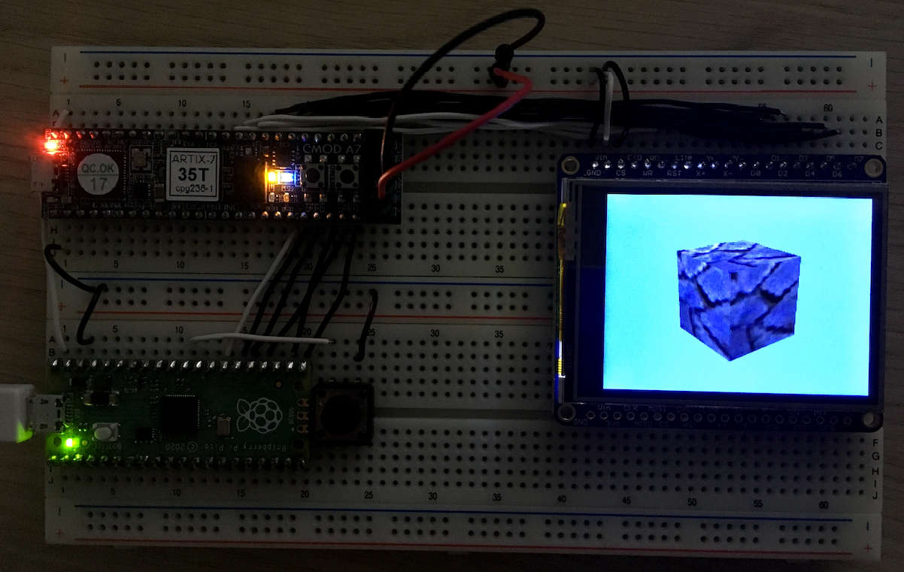

# CMOD A7 Build
The build target is a CMOD A7 board with an `XC7A35` FPGA. The interface used to connect the FPGA with a host is an SPI interface with additional CTS pin for flow control (in software).

This builds the `RasterixRF` and uses one TMU with a maximum texture resolution of 128x128px.

There is one variant available:

`rrxef`:  
  - 1 TMU (max res: 128x128)
  - Mip mapping
  - Fixpoint
  - 10MPixel maximum (because of slow SRAM)


To build the binaries, use the following commands.
```sh
cd rtl/top/Xilinx/CmodA7
/Xilinx/Vivado/2022.2/bin/vivado -mode batch -source build.tcl
```
You will find `rasterix.bin` and `rasterix.bit` in the synth directory. Use Vivado to program the FPGA or to flash the binary into the flash.

## Hardware Setup
The following hardware setup shows an Raspberry Pi Pico connected to an CMOD A7 with an `XC7A35` FPGA connected and an 320x240 pixel display with an `ILI9341` chipset.

 

The Pico is connected via SPI to the CMOD. Have a look at the following table to connect them:
| Port Name | Pico | CMOD A7 |
|-----------|------|---------|
| MOSI      | GP19 | 45      |
| SCK       | GP18 | 47      |
| MISO      | GP16 | 48      |
| CSN       | GP17 | 46      |
| CTS       | GP20 |  2      |
| RSTN      | GP21 |  1      |

Supported SPI clock speed: Max 25MHz.

The display is directly connected to the FPGA via the 8080-I parallel interface. The FPGA automatically configures the display when reset is asserted. To connect the display use the following table:

| Port Name | CMOD A7 | ILI9341 |
|-----------|---------|---------|
| CS        | 27      | GND     |
| C/D       | 28      | C/D     |
| WR        | 29      | WR      |
| RD        | 30      | RD      |
| RST       | 31      | 3.3V    |
| DATA[7:0] | [38:45] | D[7:0]  |

If you look closely, the display (Adafruit 2.4" TFT LCD Breakout Board) has a one to one mapping to the FPGA pins when connected to the breadboard. Only one wire to the displays `Vin` is required to power it. __Please note that the `Vin` of the display goes to a FPGA IO. That is not an issue as long as `Vin` does not exceed 3.3V!__
 
# RPPICO Build
Uses the [CMOD A7 Build](#cmod-a7-build) and the pico-sdk. By default, this build will download the pico-sdk automatically.

Open a terminal. Use the following commands to build a rppico binary:
```sh
cd <rasterix_directory>
cmake --preset rppico -DPICO_BOARD=pico
cmake --build build/rppico --config Release --parallel 
```
You will find a `minimal.uf2` file in the `build/rppico/example/rp-pico` directory.

Note: The rrx library heavily relies on floating point arithmetics. A MCU, like the `rp2350`, with FPU is recommended. It can speed up the overall performance of around 10 times.

# PlatformIO
If you are using [PlatformIO](https://platformio.org/) you can add this repo directly to your `platformio.ini` like this:

```ini
[env:your_env_name]
lib_deps =
  toni3141-Rasterix=https://github.com/ToNi3141/Rasterix.git
```

or you can include it as a dependency in your `library.json` like this:

```json
…
  "dependencies": 
  [
    {
      "name": "toni3141-Rasterix",
      "version": "https://github.com/ToNi3141/Rasterix.git"
    }
  ]
 …
```

An example for the Arduino framework is available under examples.