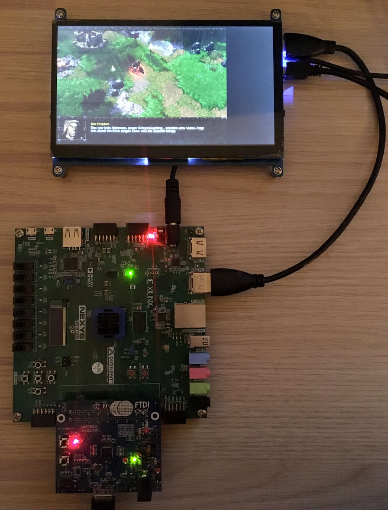
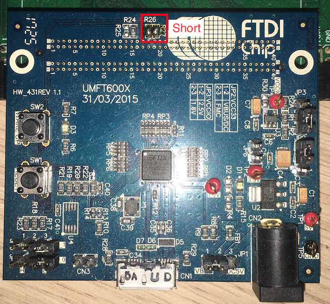

- [Nexys Video Build](#nexys-video-build)
  - [Hardware Setup](#hardware-setup)
    - [UMFT600X-B Eval Kit Preparation](#umft600x-b-eval-kit-preparation)
- [Library Build](#library-build)
  - [OSX](#osx)
  - [Windows](#windows)
  - [Linux](#linux)
  - [Build](#build)
- [Windows Build](#windows-build)
  - [Run Warcraft 3](#run-warcraft-3)


# Nexys Video Build
The build target is a Nexys Video board with an `XC7A200` FPGA. The interface used to connect the FPGA with the PC is an 16bit synchronous FT245 protocol on the Nexys FMC connector.

There are two variants available:

`rrxif`:  
  - 2 TMU (max res: 256x256)
  - Mip mapping
  - Framebuffer size: 256kB + 256kB + 64 kB
  - 25 bit fix point

`rrxef`:
  - 2 TMU (max res: 256x256)
  - Mip mapping
  - 25 bit fix point

You can build it in two variants, `rrxif` and `rrxef`. Depending on the variant, you must enable the `VARIANT_RRXIF` or `VARIANT_RRXEF` for the library build.

To build the binaries use the following commands.
```sh
cd rtl/top/Xilinx/NexysVideo
/Xilinx/Vivado/2022.2/bin/vivado -mode batch -source build_rrxif.tcl
```
You will find `rasterix.bin` and `rasterix.bit` in the synth directory. Use Vivado to program the FPGA or to flash the binary into the flash.

## Hardware Setup
Connect the Nexys Video via USB 3.0 to your computer (via the `UMFT600X-B` eval board). Connect to your Nexys Video a 1024x600 px monitor. If you don't have a monitor at hand with this resolution, you have to change the resolution in the `rtl/Display/Dvi.v` wrapper and in the software (for instance in `example/minimal/main.cpp`).

 

### UMFT600X-B Eval Kit Preparation
The current implementation uses a `UMFT600X-B` eval board from FTDI with an FT600 to connect the Nexys with an PC. It offers a USB 3.0 connection and can be connected via the FMC connector.
 
The `UMFT600X-B` must be prepared:
- JP1: 1-2 (VBUS)
- JP2: 2-3 (Select powered by FIFO master Board(default))
- JP3: 1-2 (VCCIO=2.5V(default))
- JP4: Open (Multi-Channel FIFO)
- JP5: Open (Multi-Channel FIFO)
- JP6: Open

Also the following solder bridges must be applied:
- R26: Short (GPIO: Triggers the reset line)
- R27: Short (GPIO)



# Library Build
Uses the [Nexys Video Build](#nexys-video-build).
## OSX
Before configuring and starting the build, download from FTDI (https://ftdichip.com/drivers/d3xx-drivers/) the 64bit X64 D3XX driver version 0.5.21. Unzip the archive and copy the `osx` directory to `lib/driver/ft60x/ftd3xx/`.

## Windows
Before starting the build, download from FTDI (https://ftdichip.com/drivers/d3xx-drivers/) the 32bit X86 D3XX driver version 1.3.0.4. Unzip the archive and copy the `win` directory to `lib/driver/ft60x/ftd3xx/`.

## Linux
Before configuring and starting the build, download from FTDI (https://ftdichip.com/drivers/d3xx-drivers/) the 64bit X64 D3XX driver version 1.0.14. Unzip the archive and copy the `osx` directory to `lib/driver/ft60x/ftd3xx/`.

## Build
To build the library an the minimal example, switch to the source directory and type
```sh
cd <rasterix_directory>
cmake --preset native -DVARIANT_RRXIF=ON
cmake --build build/native --config Release --parallel
```
Note for Windows: you might better use the win32 preset, it is specifically for windows (see [Windows Build](#windows-build)). Otherwise configure it with `cmake --preset native -G "Visual Studio 16 2019" -A Win32 -DVARIANT_RRXIF=ON` otherwise the build might fail.

To run the minimal example, type
```
cd build/native
./example/minimal/minimal
```
into your terminal. It should now show an image similar to the simulation.

# Windows Build
This is a more specific preset for windows which also builds WGL. Please refer to the [Windows](#windows) section as a precondition for this build.

Open a terminal. Use the following commands to create a 32bit Visual Studio Project:
```sh
cd <rasterix_directory>
cmake --preset win32 -DVARIANT_RRXIF=ON
cmake --build .\build\win32\ --config Release --parallel
```

You will find the `OpenGL32.dll` in the build directory. The DLL is build for 32bit targets because games from that era are usually 32bit builds. To test the build, type
```sh
cd build\win32
.\example\minimal\Release\minimal.exe
```
into your terminal. It should now show an image similar to the simulation.
Note: You need the `FTD3xx.dll` in you execution directory. It is automatically copied to the build directory.

## Run Warcraft 3 
Only classic Warcraft 3 will work. Reforged does not. 
- Prepare Warcraft 3. Set the resolution to something like 800x600 or below and set the texture quality to low (currently the Renderer supports only textures with a maximum size of 256x256).
- Copy the `OpenGL32.dll` together with the 32bit version of the `FTD3XX.dll` in the root directory of your Warcraft 3 installation. 
- Add a shortcut to the `Frozen Throne.exe` or `Warcraft III.exe` on your desktop. Edit the shortcut and write `-opengl` after the path of the exe (`"C:\path\to\warcraft3\Frozen Throne.exe" -opengl`) to start Warcraft 3 in OpenGL mode.
- Open Warcraft 3 via the shortcut. You should now see the menu on the screen connected to the FPGA.

Warcraft 3 runs on low settings with around 20-30FPS.

Switching the resolution and videos are currently not working.

